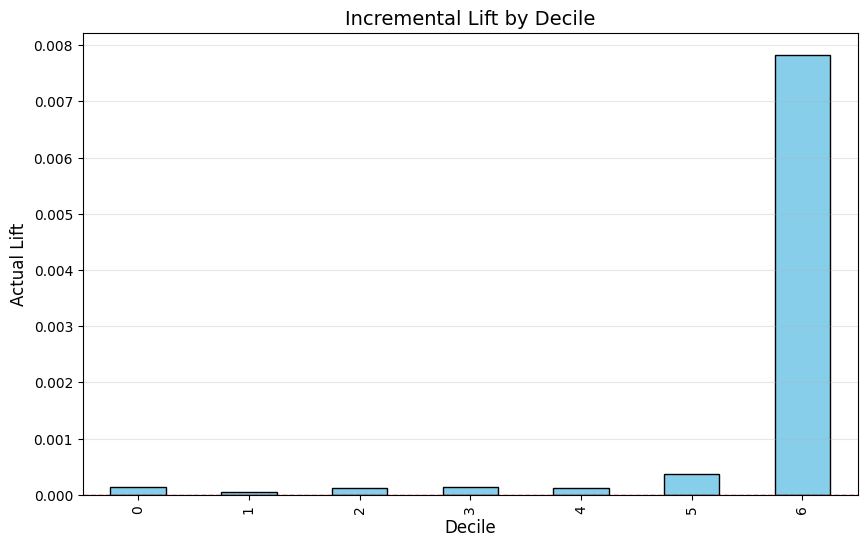

# Optimizing Christmas Campaign ROI via Uplift Modeling

## Pseudo Business Problem: New Campaign Strategy

Last year,  our brand launched a large-scale digital advertising campaign leading up to Christmas to drive purchases. While the reach was well over a million impressions, the initial A/B test results were disappointing and the **ROAS was lower than projected**.

This year, the marketing team reached out to the data science team to see if they can model for the most valuable target of customers vs burning all of their budget again. The data scientists suggested an **uplift model** where we identify the top % of customers who will convert after seeing the ad, and the **incremental gain over the control.**

## Experiment: Comparing Meta-Learners

I compared three causal inference frameworks using **XGBoost**:

1. **S-Learner (Single Model):** Uses a single model with treatment as a feature.
2. **T-Learner (Two-Model):** Trains separate models for Treatment and Control. Captured signals but showed high variance due to the 85/15 group imbalance.
3. **X-Learner (Cross-Learner):** It uses imputed treatment effects to remove noise and impovve decile ranking. **This was our chosen model.**

## Business Impact

* **Global Lift:** The average lift across the entire population was  **0.1%**.
* **The High-ROI Segment:** The model identified a segment (decile 6) comprising **10% of our population** with an actual incremental lift of **0.78%**. This is nearly **8x the baseline average**.

* **Incremental Impact:** This top 10% segment generated **2,186 incremental conversions** (sales that would not have happened without the ad).
* **Efficiency Gain:** By focusing ad spend only on this segment, we can **reduce advertising costs by 90%** while still capturing nearly 80% of the total potential sales.

##  The Qini Curve

The curve reveals aninflection point at the 10% mark, and this proves the model's ability to rank users accurately. Beyond this point, the curve flattens and yields diminishing returns.

